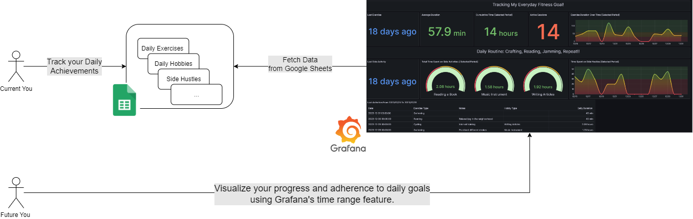
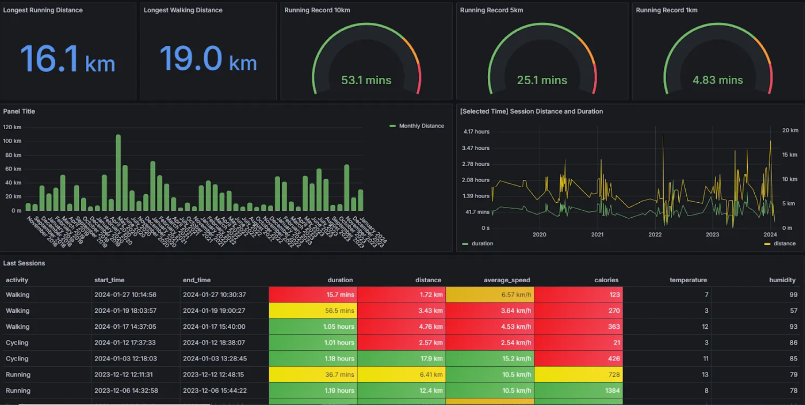

# Cloud-Native platforms and  Data Pipelines to monitor your Daily Improvements
This repository provides some reference scripts and tutorials to access Cloud-native platforms for data  analytics and day-to-day productivity

* The [google-sheets-grafana](google-sheets-grafana/README.md) directory contains the source code for a Grafana dashboard, enabling you to monitor your daily exercise routines and other side  activities. 

    

* The [runtastic_data](runtastic_data/Readme.md) directory provides a python notebook to  extract your workout files, cleans them up, and shows you some nice statistics so you can see how you're progressing over time. It loads the extracted data into a postgres database for further transformation and visualization with Grafana. A ready-to-use Grafana dashboard is provided in this same repository as well.

    
    