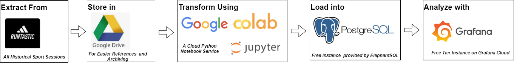

# Explore your Runtastic (Adidas Running) Data with a Jupyter Notebook on Google Cloud

This folder provides a python notebook to  extract your workout files, cleans them up, and shows you some nice statistics so you can see how you're progressing over time. It loads the extracted data into a postgres database for further transformation and visualization with Grafana. A ready-to-use Grafana dashboard is provided in this same repository as well.

## The Data Pipeline provided here

## How to use:

1. Get the Notebook:
    * In Google Colab, navigate to File/Upload a Notebook and choose the Github tab
    * Enter the URL of this repository https://github.com/nuentsa/cloud-data-tools 
    * Google Colab will scan all notebooks available in the repository
    * Choose the file extract_and_load_adidas_running_data.ipynb from the list to open the notebook
    * At this stage, a copy of the notebook is created for your own use. 
    * Feel free to edit it to suit your needs
2. Manage Secrets:
* Go to the Secrets section in Colab.
* Create/configure the following secrets:
    * Google Drive ID (optional):
        * Enter the ID of your Runtastic ZIP file if you want to download it from Google Drive.
        * You can leave this blank to upload the file manually (see step 5).
    * Postgres Connection String (optional):
        * If you want to upload data to a Postgres database, provide your connection string here.
        * You can skip this if you don't need database integration.
3. Run the Notebook:
    * Click the "Run" button or press Shift+Enter in each code cell.
4. Google Drive Access (Optional):
    * If you entered a Google Drive ID, the notebook will request permission to access your drive.
    * Grant access to download the Runtastic ZIP file.
5. Manual File Upload (Optional):
    * If you didn't use Google Drive, update the relevant code cell to specify the local path of your Runtastic ZIP file.
6. Explore and Adapt:
    * You're now ready to explore your Runtastic data!
    * Feel free to adjust the code to suit your specific needs and analysis goals.

## Resources

* [Google Colab](https://colab.research.google.com/)
* [Jupyter Documentation](https://docs.jupyter.org/en/latest/)
* [A medium article describing the main steps implemented in the notebook](https://medium.com/@Dee.N/explore-your-runtastic-adidas-running-data-with-a-jupyter-notebook-on-google-cloud-198992c2aa06)

## Contributing

We welcome contributions to this repository. If you would like to contribute, please fork the repository and submit a pull request.

## License

This project is licensed under the MIT License.